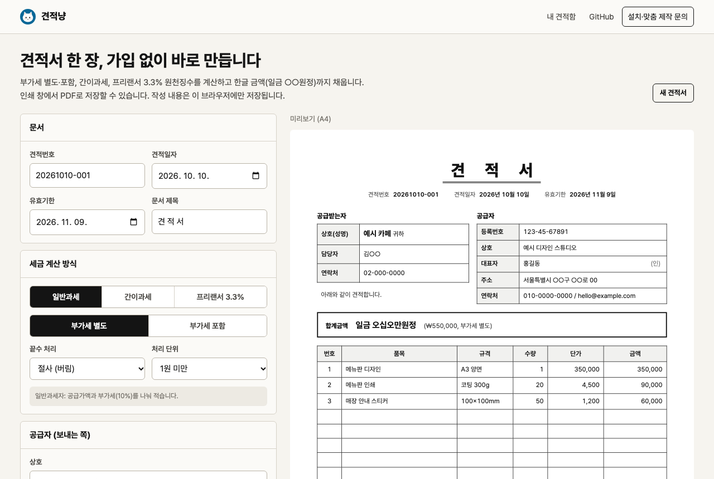

# 견적냥 (gyeonjeok-meo)

[Define404]

바로 써 보기: https://gyeonjeok.define404.com




견적서 한 장, 가입 없이 바로.

1인 사업자, 소상공인, 프리랜서를 위한 한국형 견적서 생성기입니다. 품목만 넣으면 A4 한 장짜리 견적서가 나오고, 브라우저 인쇄 창에서 PDF로 저장할 수 있습니다. 견적서를 링크로 보내면 고객이 "수락"을 누를 수 있고, 사업자마다 고객이 직접 견적을 요청하는 페이지가 생깁니다.

- 견적서 한 장 만들기와 인쇄는 가입 없이 무료입니다
- 공유 링크, 사업자 정보 저장, 견적 요청 페이지는 메일 가입(비밀번호 없음) 후 씁니다
- 사장님 본인 Cloudflare 무료 계정(Workers, D1)에서 돌아갑니다
- 오픈소스(MIT)라 누구나 무료로 쓰고 고칠 수 있습니다

상태: v0.1. Define404 운영본을 Cloudflare Workers 에 배포해 메일 로그인, 견적서 저장, 공유 링크, 탈퇴까지 실제 화면에서 확인했습니다.

## 무엇을 하나

| 기능 | 내용 |
|---|---|
| 견적서 편집기 | 공급자(상호, 대표자, 사업자등록번호, 주소, 연락처, 직인), 공급받는자, 품목(품목, 규격, 수량, 단가), 비고, 유효기한. 입력하는 대로 A4 미리보기가 바뀝니다 |
| 사업자등록번호 검증 | 10번째 검증번호를 계산해 틀린 번호를 바로 알려 줍니다 |
| 세금 계산 | 일반과세(부가세 별도, 포함), 간이과세, 프리랜서 사업소득 3.3% 원천징수 |
| 끝수 처리 | 절사, 반올림, 절상 중 고르고 단위(1원, 10원, 100원, 1,000원)도 고릅니다 |
| 한글 금액 | "일금 삼백오십만칠백오십원정". 9,999조까지 |
| 견적번호 | YYYYMMDD-NNN. 저장하면 사업자별로 서버가 매깁니다 (한국 날짜 기준) |
| 인쇄·PDF | 인쇄용 A4 서식(CSS `@page`)이라 서버 PDF 라이브러리가 필요 없습니다 |
| 공유 링크 | `/q/<추측할 수 없는 id>`. 고객이 "수락"을 누르면 시각이 기록되고 사업자에게 메일이 갑니다 |
| 견적 요청 페이지 | `/r/<주소>`. 고객이 이름, 연락처, 요청 내용을 개인정보 동의와 함께 남기면 사업자에게 메일이 가고 "내 견적함"에 쌓입니다 |
| 내 견적함 | 사업자 정보, 견적 요청 목록, 저장한 견적서와 수락 여부, 광고 수신 동의 켜고 끄기, 탈퇴 |

## 세금 계산 규칙 (세무 확인 필요)

아래는 이 도구가 쓰는 가정입니다. 세무 판단을 대신하지 않습니다. 실제 신고와 세금계산서 발급은 세무 대리인에게 확인하세요.

- **일반과세, 부가세 별도**: 단가는 공급가액. 부가세 = 공급가액 합계 x 10%, 끝수 처리 설정을 따릅니다 (기본 1원 미만 절사)
- **일반과세, 부가세 포함**: 단가는 부가세를 포함한 값. 부가세 = 합계 x 10/110 (끝수 처리 설정), 공급가액 = 합계 - 부가세. 합계는 입력한 그대로 유지됩니다
- **간이과세**: 부가세를 따로 적지 않고 합계만 적습니다. 간이과세자의 세금계산서 발급 의무나 부가세 표기 방식은 매출 규모에 따라 다릅니다. 세무 확인 필요
- **프리랜서 3.3%**: 소득세 = 견적 금액 x 3%, 지방소득세 = 소득세 x 10%, 둘 다 10원 미만 버림. 실 지급액 = 견적 금액 - 두 세금. 소액부징수(소득세 1,000원 미만이면 떼지 않음)는 반영하지 않았습니다. 세무 확인 필요
- 수량은 소수 둘째 자리까지 받고, 품목 금액(수량 x 단가)에도 끝수 처리 설정을 씁니다

## 구조

```
public/            화면 (Worker 정적 자산)
  index.html       견적서 편집기 (가입 없이)
  app.html         내 견적함 (로그인)
  js/core.js       계산, 한글 금액, 사업자번호 검증, 문서 HTML. 브라우저와 서버가 같은 파일을 씁니다
  css/doc.css      A4 견적서 서식 (화면, 인쇄 공용)
worker/            Cloudflare Worker (Hono) + D1
  src/routes/api.ts    JSON API
  src/routes/pages.ts  공유 견적서, 인쇄용 문서, 견적 요청 페이지, 로그인 확인, 광고 수신 거부 링크
  src/lib/consent.ts   광고 수신 동의 2년 만료, 보관 기간, 처리 결과 메일 문구
  src/lib/marketing.ts 수신 동의 저장, 수신 거부 토큰, 매일 정리 작업
  src/lib/mail.ts      메일 발송 (Gmail API 또는 Resend)
  src/lib/mime.ts      메일 원문(MIME) 만들기
  migrations/          D1 스키마
test/
  core.test.mjs    단위 시험
  consent.test.mjs 광고 수신 동의 2년 만료, 처리 결과 메일 문구 시험
  mail.test.mjs    메일 원문 시험 (한글 제목, 일반 글과 HTML 두 부분)
  e2e-local.mjs    로컬 통합 시험
```

## 설치

### 1. 준비물

- Cloudflare 무료 계정
- Node.js 20 이상
- (메일) Google Workspace(Gmail API) 또는 Resend 중 하나. 둘 다 넣지 않으면 메일 대신 로그에 찍힙니다. 이때는 로그인 링크도 메일로 가지 않으므로 운영에서는 필수입니다

### 2. 배포

```bash
cd worker
npm install
npx wrangler login
npx wrangler d1 create gyeonjeok-meo          # 나온 database_id 를 wrangler.toml 에 넣습니다
npx wrangler d1 migrations apply gyeonjeok-meo --remote
# 메일: Gmail API 를 쓰면 아래 세 값 (아래 "메일 보내기" 참고)
npx wrangler secret put GMAIL_CLIENT_ID
npx wrangler secret put GMAIL_CLIENT_SECRET
npx wrangler secret put GMAIL_REFRESH_TOKEN
# 또는 Resend 를 쓰면
# npx wrangler secret put RESEND_API_KEY
npx wrangler deploy
```

`wrangler.toml`의 `MAIL_FROM`은 보내는 주소로 바꿉니다 (Gmail API 면 그 Google 계정 주소, Resend 면 등록한 도메인 주소). `PRIVACY_URL`은 내 개인정보 처리방침 주소로 바꿉니다. `DEV_MODE`는 운영에서 반드시 `"0"`입니다.

매일 정리 작업은 cron 트리거를 씁니다. Workers 무료 요금제는 계정당 cron 트리거가 5개까지라, 이미 5개를 쓰는 계정이면 배포는 되지만 cron 등록만 실패합니다. 이때는 다른 Worker 의 cron 을 줄이거나 유료 요금제로 올려야 정리 작업이 돕니다.

운영 주소(`APP_URL`), 실제 `database_id`, 내 도메인 연결(`routes`)은 저장소에 올리지 않는 `wrangler.prod.toml`에 따로 두고 `npx wrangler deploy --config wrangler.prod.toml`로 배포해도 됩니다 (`.gitignore`에 들어 있습니다).

### 3. 메일 보내기

`GMAIL_CLIENT_ID`, `GMAIL_CLIENT_SECRET`, `GMAIL_REFRESH_TOKEN` 세 값이 모두 있으면 Gmail API로 보내고, 없으면 `RESEND_API_KEY`가 있을 때 Resend로 보냅니다. 둘 다 없으면 로그에만 찍습니다.

Gmail API (Google Workspace 계정) 준비:

1. Google Cloud 콘솔에서 프로젝트를 만들고 Gmail API를 켭니다
2. OAuth 동의 화면을 만듭니다. Workspace 계정이면 사용자 유형을 "내부"로 두면 검수 없이 씁니다
3. "사용자 인증 정보"에서 OAuth 클라이언트 ID를 "데스크톱 앱"으로 만듭니다. 여기서 나온 클라이언트 ID와 보안 비밀이 `GMAIL_CLIENT_ID`, `GMAIL_CLIENT_SECRET`입니다
4. 보내는 계정으로 로그인해 범위 `https://www.googleapis.com/auth/gmail.send` 하나만 허용하고 리프레시 토큰을 받습니다. 예: Google의 OAuth 2.0 Playground에서 톱니바퀴의 "Use your own OAuth credentials"에 위 두 값을 넣고, 범위에 `gmail.send`만 넣어 승인한 뒤 "Exchange authorization code for tokens"를 누르면 나오는 refresh token
5. 세 값을 `npx wrangler secret put` 으로 넣습니다. 화면에 찍거나 저장소에 올리지 않습니다
6. `MAIL_FROM`은 `견적냥 <그 계정 주소>` 형식으로 둡니다

Worker는 리프레시 토큰으로 액세스 토큰을 받아 만료 전까지 메모리에 두고, `gmail/v1/users/me/messages/send`로 메일 원문(MIME, 본문은 일반 글과 HTML 두 가지, 한글 제목 인코딩)을 보냅니다. 광고 수신 동의 처리 결과 메일에는 `List-Unsubscribe`, `List-Unsubscribe-Post`(한 번 누르면 끝나는 수신 거부) 머리글을 붙입니다.

## A4 미리보기

화면 미리보기는 A4 문서를 화면 폭에 맞춰 줄여 보여 줍니다. 폭이 600px보다 좁은 휴대폰에서는 미리보기 위에 "크게 보기" 버튼이 나오고, 누르면 문서를 원래 크기로 보여 주며 문서 상자 안에서만 옆으로 밀어 볼 수 있습니다 (페이지 전체는 옆으로 넘치지 않습니다). 인쇄와 PDF 서식은 바뀌지 않습니다.

## 로컬에서 시험하기

```bash
cd worker
npm install
npx wrangler types
npx wrangler d1 migrations apply gyeonjeok-meo --local
npx wrangler dev --var DEV_MODE:1
```

`DEV_MODE:1`이고 메일 키가 없으면 로그인 링크를 화면에 바로 보여 줍니다. 다른 창에서:

```bash
npm test                                   # 단위 시험 (worker 폴더에서)
node ../test/e2e-local.mjs http://localhost:8787
```

## 설정 값

| 이름 | 위치 | 설명 |
|---|---|---|
| `APP_NAME` | vars | 메일 제목에 붙는 이름 |
| `CTA_URL` | vars | "설치·맞춤 제작 문의" 버튼 주소이자 안내 메일의 연락처 (기본값 https://contact.define404.com) |
| `OPERATOR_NAME` | vars | 광고성 정보 수신 동의를 받는 곳, 동의 처리 결과 메일의 보낸 곳 (기본값 Define404) |
| `APP_URL` | vars | 운영 주소. 정기 작업이 보내는 메일(2년 만료 알림)의 링크에 씁니다. 비우면 링크 없이 보냅니다 |
| `PRIVACY_URL` | vars | 동의 문구와 바닥글의 "개인정보 처리방침" 링크 (기본값 https://contact.define404.com/privacy.html) |
| `MAIL_FROM` | vars | 보내는 메일 주소. 표시 이름은 서비스 이름 |
| `DEV_MODE` | vars | 로컬 시험 전용. 운영은 `"0"` |
| `GMAIL_CLIENT_ID`, `GMAIL_CLIENT_SECRET`, `GMAIL_REFRESH_TOKEN` | secret | Gmail API 메일 발송 (셋 다 있으면 먼저 씁니다). 범위는 `gmail.send` 하나 |
| `RESEND_API_KEY` | secret | Gmail 값이 없을 때 쓰는 Resend 메일 발송 |

## 보안

- 비밀번호를 저장하지 않습니다. 메일 로그인 링크(20분, 한 번만)와 세션(30일)만 쓰고, 둘 다 원문이 아닌 SHA-256 해시로 저장합니다
- 메일 링크를 열면 "로그인" 버튼을 한 번 더 누르게 합니다. 메일 보안 검사기가 링크를 미리 열어 토큰을 써 버리지 않게 하려는 것입니다
- 공유 견적서 id, 세션, 로그인 토큰은 128~256비트 난수입니다. 견적 요청 페이지 주소는 공개용이라 10자(약 50비트)입니다
- 모든 조회·삭제는 로그인한 계정의 사업자 것만 찾습니다. 다른 계정의 견적 요청이나 견적서를 요청하면 404입니다
- 금액은 서버가 항상 다시 계산합니다. 화면이 보낸 합계는 쓰지 않습니다
- 쿠키는 HttpOnly, SameSite=Lax이고, 다른 사이트에서 보낸 쓰기 요청(Origin 불일치)은 403입니다
- 접속자별 요청 제한(1분 30회, 쓰기 요청), 같은 메일 로그인 링크 1시간 5회, 견적 요청은 같은 접속자 10분 5회와 사업자당 하루 100회
- 콘텐츠 보안 정책(CSP), `Referrer-Policy: no-referrer`(공유 링크 주소가 다른 사이트로 새지 않게), 공유·요청 페이지 검색 노출 차단
- 직인 이미지는 브라우저(localStorage)에만 두고 서버로 보내지 않습니다. 그래서 공유 링크와 서버 인쇄용 페이지에는 직인 대신 "(인)"이 나옵니다

## 개인정보와 광고 수신

법률 자문이 아니라 이 도구가 지키는 운영 기준입니다. 근거: 개인정보 보호법 제15조 제2항, 제22조 제1항·제5항, 정보통신망법 제50조.

| 무엇을 | 왜 | 얼마나 두나 |
|---|---|---|
| 가입 메일 주소 | 로그인 링크, 견적 요청·수락 알림 | 탈퇴할 때까지. 7일 안에 로그인을 마치지 않으면 지웁니다 |
| 사업자 정보(상호, 대표자, 사업자등록번호, 주소, 연락처), 견적서 | 견적서 저장·공유, 견적 요청 페이지 | 탈퇴할 때까지 (탈퇴하면 한 번에 지웁니다) |
| 견적 요청(이름 또는 회사명, 연락처, 요청 내용, 접속 IP 해시값) | 사업자의 견적 상담과 회신. IP 해시는 요청 남용 방지용 | 접수일로부터 1년. 그 전에 사업자가 지우거나 탈퇴하면 바로 |
| 견적 수락자 성함(선택) | 수락 기록 | 견적서를 지우거나 탈퇴할 때까지 |
| 광고성 정보 수신 동의 여부와 시각 | 안내 메일 발송 여부 판단 | 탈퇴할 때까지. 동의 자체는 2년이 지나면 자동으로 꺼집니다 |

- 동의 문구: 필수 동의(가입, 견적 요청)마다 목적, 항목, 보유·이용 기간, 거부할 권리와 거부하면 못 쓰는 기능을 적었습니다 (보호법 제15조 제2항)
- 광고성 정보 수신 동의: 필수 동의와 따로 받는 선택 항목이고 기본은 체크 해제입니다. 동의하지 않아도 모든 기능을 똑같이 씁니다 (보호법 제22조 제1항·제5항, 망법 제50조 제1항)
- 가입·로그인 화면에서 체크한 수신 동의는 메일로 받은 링크로 로그인을 마쳐야 기록됩니다. 남의 메일 주소를 넣어 그 사람의 동의를 켤 수 없습니다
- 처리 결과 알림: 동의, 철회, 2년 만료 때마다 결과를 메일로 보냅니다. 메일 키가 없으면 로그에 남깁니다 (망법 제50조 제7항)
- 철회: 내 견적함의 체크 해제, 또는 안내 메일 속 수신 거부 링크(`/m/off`, 로그인 없이 한 번에, 비용 없음). 철회 뒤에는 보내지 않습니다 (망법 제50조 제2항·제4항~제6항)
- 2년마다 재확인: 다시 묻는 대신 동의한 날부터 2년이 지나면 동의를 자동으로 끄고 알립니다. 다시 동의하면 그날부터 2년을 새로 셉니다 (망법 제50조 제8항)
- 보관 기간 정리와 2년 만료는 매일 한국 시간 오전 10시에 도는 정기 작업(`wrangler.toml`의 `[triggers]`)이 처리합니다
- 지금 이 도구가 보내는 메일(로그인 링크, 견적 요청·수락 알림, 동의 처리 결과)에는 광고가 없습니다. 화면의 "설치·맞춤 제작 문의" 버튼은 메일이 아닙니다
- 나중에 광고 메일을 보낸다면 지켜야 할 것: 수신 동의가 유효한 계정(`marketingActive`, 메일 인증을 마친 계정)에만, 제목 맨 앞에 "(광고)", 본문에 보낸 곳(Define404)과 연락처(https://contact.define404.com), 수신 거부 링크, 밤 9시부터 아침 8시(한국 시간) 사이에는 보내지 않기 (망법 제50조 제3항·제4항)
- 견적 요청 페이지로 받은 개인정보를 처리하는 주체는 그 페이지의 사업자입니다
- 운영하는 쪽은 개인정보 처리방침에 수집 항목, 보유 기간, 위탁 업체(Cloudflare, 메일 발송 업체)를 적어 두어야 합니다. 이 저장소에는 처리방침 문서가 없고, 화면의 동의 문구와 바닥글은 `PRIVACY_URL`의 처리방침으로 연결합니다. 기본값은 Define404 운영본의 처리방침이라 직접 설치하면 바꿔야 합니다
- 동의 문구에는 처리 위탁·국외 이전(서버와 저장은 Cloudflare, Inc., 메일 발송은 Google LLC, 둘 다 미국)을 적었습니다. Resend를 쓰면 이 줄도 고칩니다

## 아직 하지 않은 것

- 실제 Cloudflare 배포는 아직 하지 않았습니다 (로컬 `wrangler dev`와 D1 로컬 모드에서 시험). Gmail API 실발송은 로컬 Worker에서 확인했고, Resend 실발송은 시험하지 않았습니다
- 사업자 한 계정에 사업자 정보 하나만 둡니다
- 견적 요청 페이지 주소는 무작위입니다. 원하는 주소로 바꾸는 기능은 없습니다
- 견적서 수정은 없습니다. 고친 견적서는 새 번호로 다시 저장합니다

## 만든 곳

[Define404](https://contact.define404.com) · JohnLKim

자기 서버에 설치하기, 회사 양식에 맞춘 견적서, 결재·고객 관리 연동이 필요하면 Define404에 문의해 주세요: https://contact.define404.com

---

## English

견적냥 (gyeonjeok-meo) is an open-source Korean quote (견적서) generator for sole proprietors, small businesses and freelancers. It validates the Korean business registration number checksum, computes VAT (exclusive/inclusive), simplified-taxpayer totals and the 3.3% freelancer withholding with configurable rounding, writes the amount in Korean words ("일금 ○○원정"), and prints a single A4 page via CSS `@page` (save as PDF from the browser). Signed-up users get share links with an "accept" button and a per-business quote request page that collects client leads with consent. Passwordless email login (magic link), hashed tokens, per-account scoping (no IDOR), rate limits. Runs on Cloudflare Workers (Hono) + D1. Mail goes through the Gmail API (Google Workspace, send-only OAuth refresh token) or Resend. Tax rules are assumptions, not tax advice. MIT licensed.
